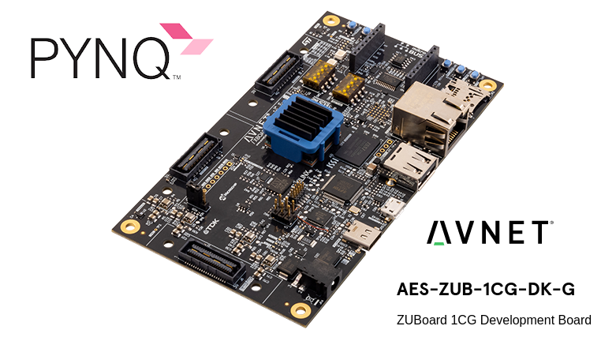
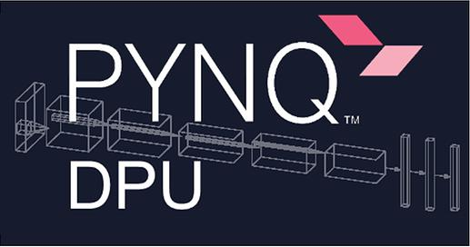

# **Grab the pre-built SD images**
[Click here to obtain the SD card image](http://www.pynq.io/board.html)

## Need a little help building your own Vivado ZUBoard 1CG PYNQ Overlays?
See the ZUBoard_1CG Jupyter Notebooks folder: creating_ZUBoard_1CG_overlays.ipynb

## Optional: add on Xilinx Vitis AI hardware accelerated inference for PYNQ
25+ boards supported, including ZUBoard 1CG, [click here for how to get started!](https://github.com/Xilinx/DPU-PYNQ)



## Build your own PYNQ SD image for ZUBoard 1CG
This is OPTIONAL for advanced users if they want to rebuild their own PYNQ images.

This repository contains source files and instructions for building PYNQ to run on the [ZUBoard 1CG board](https://www.avnet.com/wps/portal/us/products/avnet-boards/avnet-board-families/zuboard-1cg/).

Building PYNQ can take a while.  Plan accordingly!

**Required tools:**
* Ubuntu 18.04 or 20.04 LTS 64-bit host PC 
* Passwordless SUDO privilege for the building user
* At least 160GB of free hard disk space if you do not have the Xilinx tools installed yet
* Roughly 80GB of free hard drive space if you have the Xilinx tools installed
* You may be able to work with less free hard drive space, YMMV
* At least 8GB of RAM (more is better)
* Xilinx Petalinux and Vitis or Vivado v2022.1 tools
* Read Xilinx UG1144 for Petalinux host PC setup requirements
* [Create a Xilinx account](https://www.xilinx.com/registration/create-account.html) to obtain and license the tools

### Step 1: Setup the tools
Make sure you 'source' the settings64.sh (Vivado) and settings.sh (PetaLinux) scripts to add them to your path before beginning the build.

### Step 2: One time PYNQ tools setup
* Clone PYNQ from https://github.com/Xilinx/PYNQ and checkout branch: image_v3.0.1
* cd into the clone and proper branch, then execute "./sdbuild/scripts/setup_host.sh"
* Install any requested additonal Debian apt packages that setup_host.sh asks for
* Once setup_host.sh is successful, reboot and re-login
* You may remove the just cloned PYNQ git repo, it is no longer needed

### Step 3: Clone the ZUBoard 1CG repository
Retrieve the ZUBoard 1CG PYNQ board git into a new directory somewhere outside the prior PYNQ git directory.

Clone the git repo and checkout the `image_v3.0.1` branch.

```shell
git clone https://github.com/Avnet/ZUBoard_1CG-PYNQ.git --branch image_v3.0.1
```

### Step 4: Build the SD image
Execute a simple build script that will create an SD image.

Before executing the script, cd into the previously cloned repo directory.

```shell
cd ZUBoard_1CG-PYNQ
./buildzu.sh
```

The build script will first download the PYNQ git repo then a large rootfs, other files and appropriate bsp files. The downloads can take some time.
Once the files are downloaded, the script is smart enough to use what has already been downloaded.

### Step 5: Burn the SD image
Please use Balena Etcher or Win32 Disk Imager to copy the .img file onto an SD card 16GB or larger.  Delkin and SanDisk uhs-1 type cards work well, other brands may also.  Samsung and rebrand cards have not been tested.
